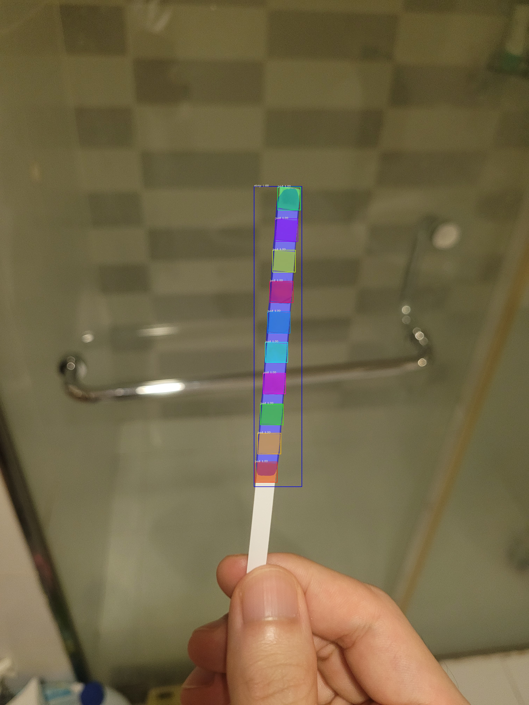
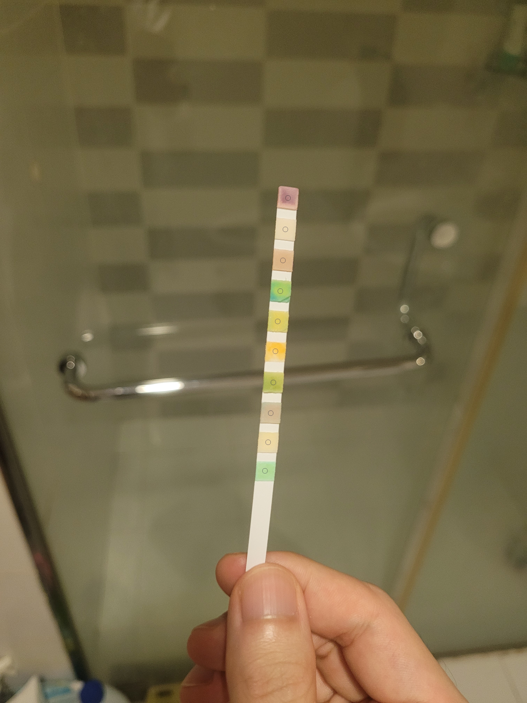
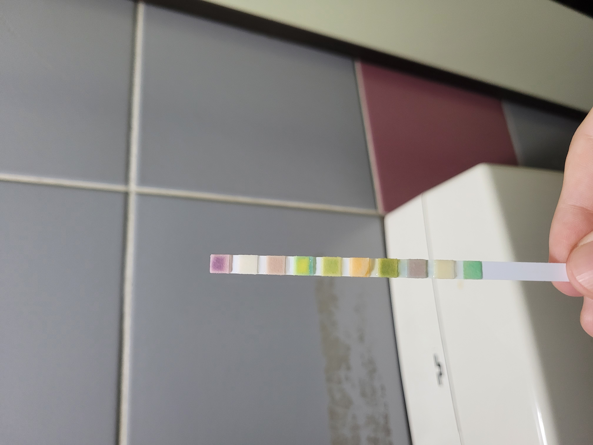
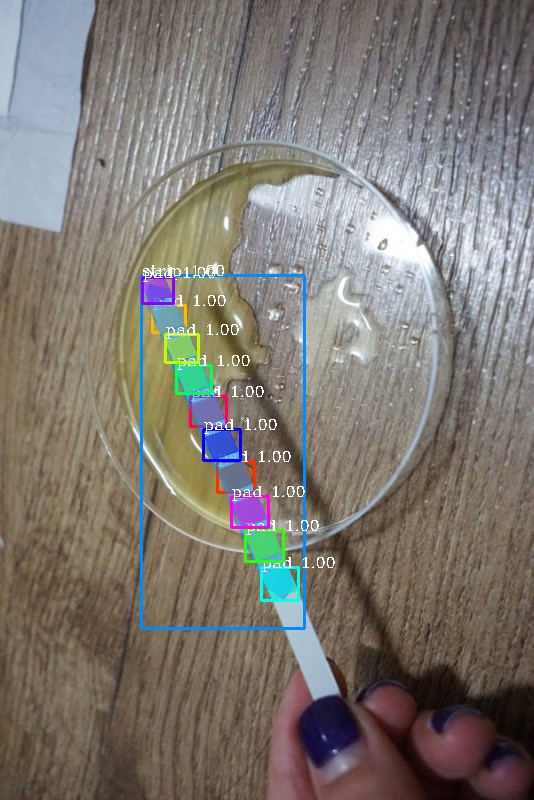
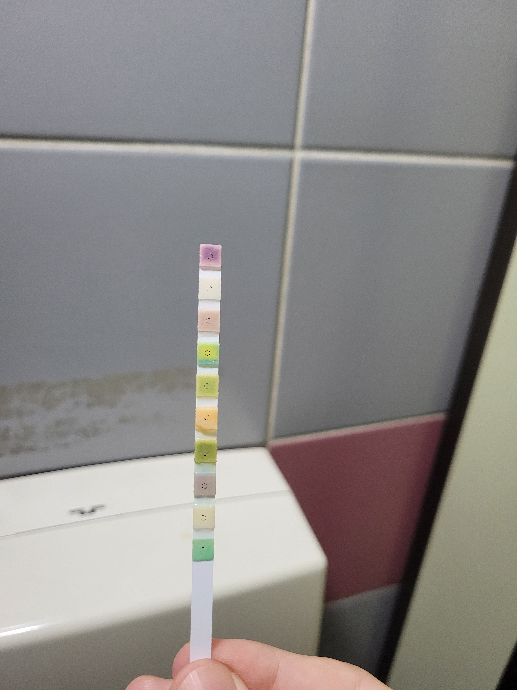
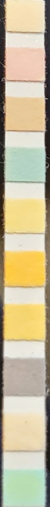

# Strip detection
<table>
  <tr>
    <td></td>
    <td></td>
    <td></td>
  </tr>
  
 </table>

The project contains:
1. Urinalysis strip detection with [Pixellib](https://github.com/ayoolaolafenwa/PixelLib) and [MaskRCNN](https://github.com/matterport/Mask_RCNN)
2. Postprocess using the result of detection


## Training
There are two version of Pixellib to train the model with the custom dataset.

1. Original [Pixellib](https://github.com/ayoolaolafenwa/PixelLib).
2. The one i have customed.  
  
If you choose to train in the first way, you must install Pixellib first.

```
!pip install pixellib
```
And check the tutorials for custom train [here](https://github.com/ayoolaolafenwa/PixelLib/blob/master/Tutorials/custom_train.md). You can use the latest version of Pixellib.  

I have customed bc version hohwan btwn Labelme2coco and Pixellib. I have also found some errors bco version when building a model with Mask-RCNN.

```python
from custom_training import instance_custom_training
import tensorflow as tf

train_mrcnn = instance_custom_training()
train_mrcnn.modelConfig(network_backbone="resnet101", num_classes=2, batch_size=2, detection_threshold=0.7)
train_mrcnn.load_pretrained_model("model/mask_rcnn_coco.h5")
train_mrcnn.load_dataset("dataset")
train_mrcnn.train_model(num_epochs=300, augmentation=True, path_trained_models="model/mask_rcnn_models")
```

## Detection
After training the model, you can check the performance of your model on different image from the dataset.




```python
from instance import custom_segmentation
from postprocess import Strip

seg = custom_segmentation()
seg.inferConfig(num_classes=2, class_names=["BG", "strip", "pad"])
seg.load_model("MaskRCNN_resnet101.h5")
result, output, masks = seg.segmentImage("sample_image.jpg", show_bboxes=True, mask_points_value=True, return_masks=True)
```



## Circles
각 패드의 중앙에 표시되는 원을 통해 패드를 올바르게 인식하고 있는지 확인할 수 있다.


```python
from instance import custom_segmentation
from postprocess import Strip

seg = custom_segmentation()
seg.inferConfig(num_classes=2, class_names=["BG", "strip", "pad"])
seg.load_model("MaskRCNN_resnet101.h5")
result, output, masks = seg.segmentImage("sample_image.jpg", return_masks=True)

pp = Strip("sample_image.jpg", result, masks, num_pads=10)
img = pp.check_pad()
```



## Cut
촬영된 이미지에서 다양한 각도로 기울어져 있는 스트립을 추출하여 일정한 형태로 가공할 수 있다. 
```python
from instance import custom_segmentation
from postprocess import Strip

seg = custom_segmentation()
seg.inferConfig(num_classes=2, class_names=["BG", "strip", "pad"])
seg.load_model("MaskRCNN_resnet101.h5")
result, output, masks = seg.segmentImage("sample_image.jpg", return_masks=True)

pp = Strip("sample_image.jpg", result, masks, num_pads=10)
img = pp.cut_strip()
```



## References
1. PixelLib, https://github.com/ayoolaolafenwa/PixelLib
2. Matterport, Mask R-CNN for object detection and instance segmentation on Keras and TensorFlow https://github.com/matterport/Mask_RCNN 