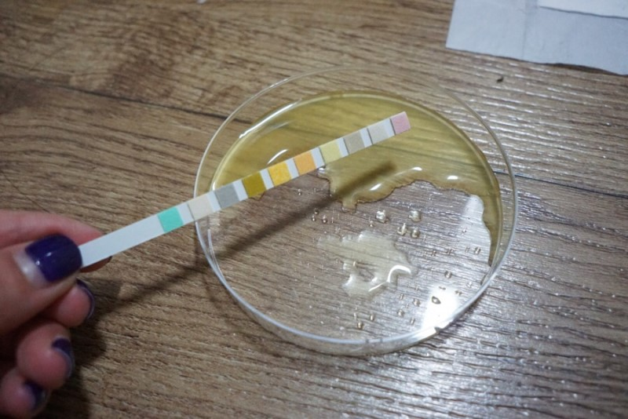
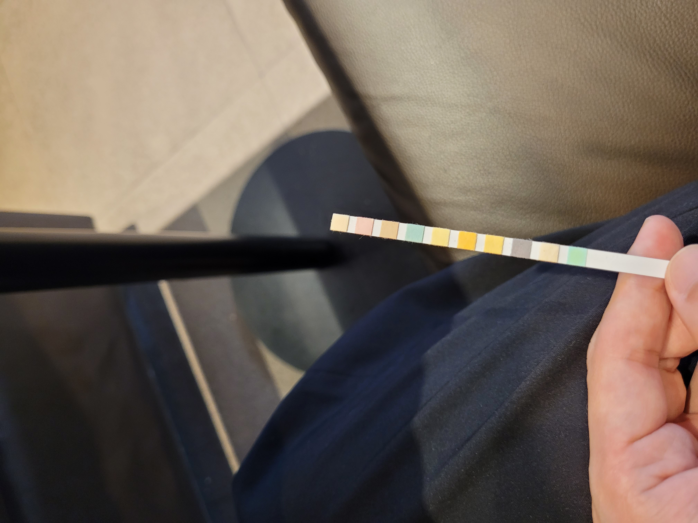

# Strip detection
<table>
  <tr>
    <td></td>
    <td></td>
    <td></td>
  </tr>
</table>

## The project contains:
1. Custom training for urinalysis strip detection through [Pixellib](https://github.com/ayoolaolafenwa/PixelLib) and [MaskRCNN](https://github.com/matterport/Mask_RCNN)
2. Urinalysis strip detection with the trained model.
3. Postprocess using the result of detection


# Training
First, you need to prepare a dataset through the annotation tool called [Labelme](https://github.com/wkentaro/labelme). 
Then, follow the [tutorials](https://github.com/ayoolaolafenwa/PixelLib/blob/master/Tutorials/custom_train.md) on loading and training with custom dataset. 
One thing to note is that the versions between Labelme2coco and Pixellib are not compatible so it is recommended to load and train your dataset through the uploaded Pixellib.

```python
from custom_training import instance_custom_training
import tensorflow as tf

train_mrcnn = instance_custom_training()
train_mrcnn.modelConfig(network_backbone="resnet101", num_classes=2, batch_size=2, detection_threshold=0.7)
train_mrcnn.load_pretrained_model("model/mask_rcnn_coco.h5")
train_mrcnn.load_dataset("urinalysis_strip_dataset")
train_mrcnn.train_model(num_epochs=300, augmentation=True, path_trained_models="model/mask_rcnn_models")
```

# Inferencing
After training the model, you can check the performance of your model on different image from the dataset.

<table>
  <tr>
    <td></td>
    <td></td>
  </tr>
</table>


```python
from instance import custom_segmentation
from postprocess import Strip

seg = custom_segmentation()
seg.inferConfig(num_classes=2, class_names=["BG", "strip", "pad"])
seg.load_model("MaskRCNN_resnet101.h5")
result, output, masks = seg.segmentImage("sample_image.jpg", show_bboxes=True, mask_points_value=True, return_masks=True)
```


# Postprocess
Use the customed Pixellib uploaded to extract the mask value for the postprocess.

## Circles
You can check wheter each pad is detected correctly through the circle displayed in the center of each pad.

<table>
  <tr>
    <td></td>
    <td></td>
  </tr>
</table>

```python
from instance import custom_segmentation
from postprocess import Strip

seg = custom_segmentation()
seg.inferConfig(num_classes=2, class_names=["BG", "strip", "pad"])
seg.load_model("MaskRCNN_resnet101.h5")
result, output, masks = seg.segmentImage("sample_image.jpg", return_masks=True)

pp = Strip("sample_image.jpg", result, masks, num_pads=10)
img = pp.check_pad()
```


## Cut
Strips can be photographed at various angles and sizes. You can extract the strip excluding the background and edit to certain angle and size.  



```python
from instance import custom_segmentation
from postprocess import Strip

seg = custom_segmentation()
seg.inferConfig(num_classes=2, class_names=["BG", "strip", "pad"])
seg.load_model("MaskRCNN_resnet101.h5")
result, output, masks = seg.segmentImage("sample_image.jpg", return_masks=True)

pp = Strip("sample_image.jpg", result, masks, num_pads=10)
img = pp.cut_strip()
```


## References
1. PixelLib, https://github.com/ayoolaolafenwa/PixelLib
2. Labelme, https://github.com/wkentaro/labelme
3. Matterport, Mask R-CNN for object detection and instance segmentation on Keras and TensorFlow https://github.com/matterport/Mask_RCNN 